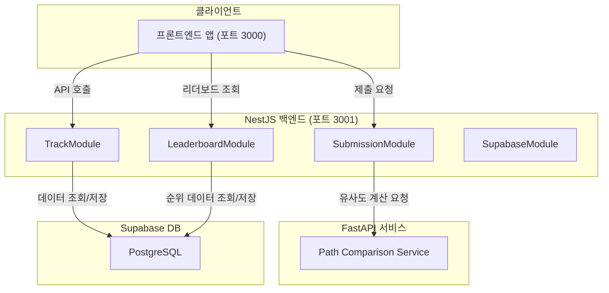
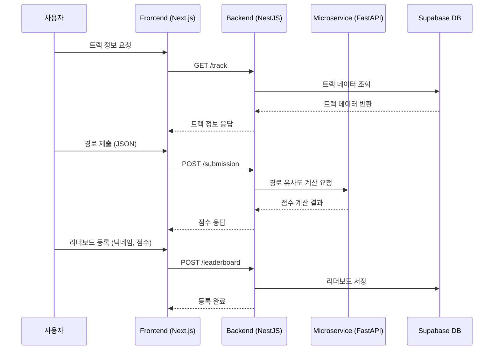

# F1 Sketch Backend

## 🏎️ 프로젝트 개요

F1 Sketch Backend는 [F1 Sketch](https://f1sketch.com)를 위하여 사용자가 그린 F1 레이싱 트랙 레이아웃을 실제 서킷 데이터와 비교해 정확도를 채점하고, 리더보드를 관리하는 REST API 서버입니다.
주요 기능은 트랙 데이터 CRUD, 드로잉 제출 시 유사도 계산·채점, 그리고 전용 리더보드 시스템입니다.

### 핵심 기능

#### 🎯 트랙 관리 시스템

- **CRUD 작업**: F1 레이싱 트랙 메타데이터 및 좌표 정보 생성·조회·수정·삭제
- **엔드포인트**:

  - `GET /track` — 전체 트랙 조회
  - `POST /track` — 새 트랙 등록
  - `PATCH /track/:id` — 트랙 정보 수정
  - `DELETE /track/:id` — 트랙 삭제

#### ✏️ 드로잉 제출 및 채점 시스템

- **제출 처리**: 사용자가 그린 트랙 경로(JSON)를 수신
- **유사도 계산**: FastAPI 마이크로서비스와 HTTP 통신을 통해 Hausdorff distance 기반 비교
- **점수 산출**: 실제 트랙과의 오차를 0–100점 사이로 환산하여 반환
- **핵심 로직 위치**:

#### 🏆 리더보드 시스템

- **전체/트랙별 순위 관리**: 사용자별 최고 점수 집계 및 정렬
- **API 엔드포인트**:

  - `GET /leaderboard` — 전체 리더보드 조회
  - `POST /leaderboard` — 사용자 점수 등록

## 🛠️ 기술 스택

### Backend

- **Framework**: NestJS
- **Language**: TypeScript
- **HTTP Server**: Express

### Database 및 ORM

- **Database**: Supabase (PostgreSQL)
- **ORM**: TypeORM
- **Driver**: pg

### API 문서화 및 개발 도구

- **API 문서**: Swagger/OpenAPI
- **테스트**: Jest
- **코드 품질**: ESLint + Prettier

### 통신 및 인프라

- **Microservice**: FastAPI (경로 비교 알고리즘)
- **배포 플랫폼**: Vercel (서버리스)
- **CORS**: 지원

## 🏗️ 시스템 아키텍처





### 컴포넌트 구조

- **TrackModule**: 트랙 CRUD API
- **SubmissionModule**: 드로잉 검증 및 채점 로직
- **LeaderboardModule**: 순위 관리 API
- **SupabaseModule**: 데이터베이스 클라이언트 제공
- **ConfigModule**: 환경 변수 및 설정 관리

## 🌐 배포 및 접속

**웹사이트**: [f1sketch.com](https://f1sketch.com)

서비스는 현재 운영 중이며, 데스크톱과 모바일 환경 모두에서 접속 가능합니다. 다만 트랙을 그리는 기능을 모바일에서 어떻게 최적화 할 지 고민 중이기에 모바일 환경에서는 트랙 선택 및 그리기 기능이 제한되어 있습니다.

## 🎨 주요 특징

### 모듈형 아키텍처

NestJS의 모듈 시스템을 활용하여 각 기능별 독립성과 확장성을 보장합니다.

### 외부 서비스 연동

- Supabase를 통한 안정적 데이터 관리
- FastAPI 기반 경로 비교 마이크로서비스로 점수 계산 분리

## 📋 개발 과정

### 기여도와 역할

- 전체 기획, 요구사항 정의 및 마일스톤 관리
- 아키텍처 설계 및 핵심 모듈 구현
- 외부 서비스(Supabase, FastAPI) 통합
- RESTful API 설계 및 Swagger 문서화

프로젝트 기능 요구사항 정리 및 개발 타임라인은 다음 링크에서 확인할 수 있습니다:  
[프로젝트 관리 문서](https://guttural-stinger-5d4.notion.site/20caa997cf3680e18596f24354937e05?source=copy_link)

모든 기능 개발 및 배포는 개인 개발자로 진행하였습니다.

[프론트엔드 서비스](https://github.com/goosull/f1sketch_frontend)
[API 서비스](https://github.com/goosull/f1sketch_api)

## 🚀 로컬 실행

```bash
# 프로젝트 루트에서
npm run dev
# 또는
yarn dev
```

- 이후 [http://localhost:3001/api](http://localhost:3001/api)에서 백엔드 API를 확인할 수 있습니다.
